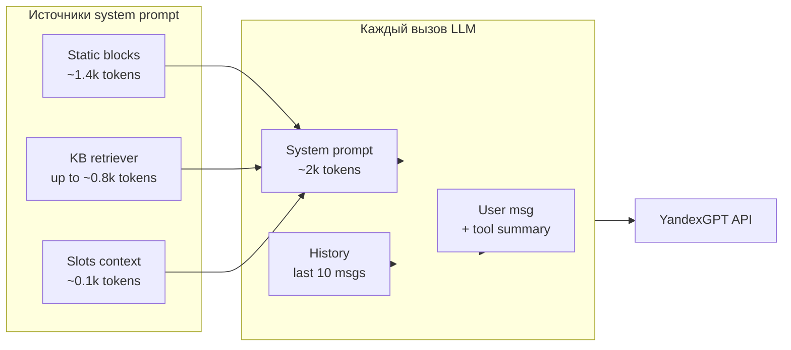

# Куда утекают токены: причины и что жрёт больше всего

## Исходные цифры (твоя сессия)

- **Всего за диалог:** 14 427 токенов (12 085 prompt + 2 342 completion).
- **Вызовов LLM:** 5–6 (по логам `BUILD_MESSAGES: 2 msgs` … `10 msgs` = 5 шагов; при вызове `get_filtered_schedule` делается второй вызов с результатом инструмента).
- **Размер системного промпта в логах:** 7 739–8 065 символов на каждый вызов (~1 900–2 000 токенов при ~4 симв/токен).

---

## 1. Главный потребитель: системный промпт (отправляется при каждом вызове)

Системный промпт собирается в [app/core/prompt_builder.py](app/core/prompt_builder.py) в `build_system_prompt()` и состоит из блоков:

| Блок | Метод | Оценка размера (символы) | Примечание |
|------|--------|---------------------------|------------|
| Роль и тон | `_role_and_tone()` | ~400 | Фиксированный текст |
| Правила продаж | `_sales_rules()` | ~1 800 | 11 правил, фиксированный текст |
| Контекст слотов | `_format_slots_context()` | ~200–500 | JSON с состоянием диалога |
| Контакт (имя/телефон) | `_contact_collection_instruction()` | 0 или ~200 | Условно |
| **Контекст из KB** | **`retriever.retrieve()`** | **до 3 200** | **Жёсткий лимит в [app/knowledge/retriever.py](app/knowledge/retriever.py) `MAX_CONTEXT_CHARS = 3200`** |
| Инструменты | `_format_tools()` | ~350 | Фиксированный текст |
| Ограничения | `_constraints()` | ~900 | Фиксированный текст |
| Правила intent | `_intent_rules()` | ~450 | Фиксированный текст |
| Формат ответа | `_response_format()` | ~1 100 | Фиксированный текст |

**Итого системный промпт:** ~5 400 (без retriever) + до 3 200 (retriever) ≈ **7 700–8 600 символов** — совпадает с логами.

**Почему это даёт основной расход:** один и тот же системный промпт уходит в API при **каждом** вызове LLM. 5–6 вызовов × ~2 000 токенов ≈ **10 000–12 000 входных токенов** только на системный промпт — это и есть большая часть твоих 12 085 prompt-токенов.

---

## 2. Второй фактор: два вызова за один ход при tool_calls

Цепочка в [app/core/engine.py](app/core/engine.py):

1. Первый вызов LLM с сообщением пользователя → модель возвращает `tool_calls` (например, `get_filtered_schedule`).
2. Выполняются инструменты ([engine.py](app/core/engine.py) `_execute_tool_calls`), результат обрезается в `_summarize_tool_result()` до 500 символов (первые 6 строк).
3. **Второй вызов LLM** с теми же `messages` плюс блок вида `[get_filtered_schedule]: 
` ([engine.py](app/core/engine.py) строки 292–296, 296).

В итоге один пользовательский ход с расписанием даёт **два** запроса к API: оба с полным системным промптом и одной и той же историей. Дублируется не только системный промпт, но и вся предыдущая история.

---

## 3. Третий фактор: история диалога (последние 10 сообщений)

В [app/core/engine.py](app/core/engine.py) в `_build_messages()` в контекст берутся последние 10 сообщений из `slots.messages` (строка 526). При сохранении ответа бота в `_append_history()` он обрезается до 1 500 символов (строка 761). Теоретический максимум: 10 × 1 500 = 15 000 символов (~3 750 токенов) только на историю. В коротком диалоге история меньше, но к концу сессии (например, 10 сообщений в логе) она уже даёт сотни–тысячу токенов на вызов и растёт с каждым ходом.

---

## 4. Что не жрёт токены (уже ограничено)

- **Результат инструмента при втором вызове:** обрезается до 500 символов (`_summarize_tool_result`, [engine.py](app/core/engine.py) 47–56).
- **Расписание в системный промпт не попадает** — только через вызов `get_filtered_schedule` и краткий summary во втором вызове.
- **KB retriever** ограничен 3 200 символами на один вызов ([retriever.py](app/knowledge/retriever.py) 19, 272–281).

---

## Визуализация потока токенов

---

## Приоритеты оптимизации (без изменения кода в плане)

1. **Сократить системный промпт**  
   Самый большой выигрыш: уменьшить статические блоки (правила, ограничения, формат ответа) — вынести часть в краткие пункты, убрать дубли, сократить примеры. Цель по RFC: \<6 000 символов (сейчас 7.7k–8k).

2. **Снизить лимит retriever или сделать его фаза-зависимым**  
   Сейчас до 3 200 символов на каждый вызов; для фаз подтверждения/записи можно отдавать меньше контекста (например, только адрес и dress code).

3. **Уменьшить число повторных вызовов при tool_calls**  
   Рассмотреть сценарии, где после `get_filtered_schedule` можно не делать второй полный вызов LLM, а формировать короткий ответ по шаблону (например, «ближайшее занятие — дата, время. Записать?») и не слать второй раз полный системный промпт и историю.

4. **Ограничить окно истории**  
   Вместо последних 10 сообщений использовать 6–8 или ограничивать суммарный размер истории в символах (например, не более 4 000 символов), чтобы поздние шаги диалога не раздували контекст.

5. **Диагностика по БД**  
   В `llm_calls` пишется `request_json` с массивом `messages`. Можно один раз посчитать длину `content` по каждому вызову (например, через SQL по `request_json->'messages'`) и вывести распределение: система vs история vs последнее сообщение — это даст точные цифры «что жрёт больше всего» по твоим реальным сессиям.

---

## Краткий вывод

- **Больше всего токенов уходит на системный промпт:** он повторяется при каждом из 5–6 вызовов и даёт основную долю 12k prompt-токенов.
- Внутри системного промпта главные части — **статические блоки** (роль, правила, ограничения, формат) и **контекст KB retriever** (до 3.2k символов).
- Дополнительно увеличивают расход **второй вызов LLM** при использовании инструментов и **рост истории** к концу диалога.
- Оптимизация системного промпта и, при необходимости, retriever/history даст наибольшее снижение расхода токенов без потери качества диалога.
